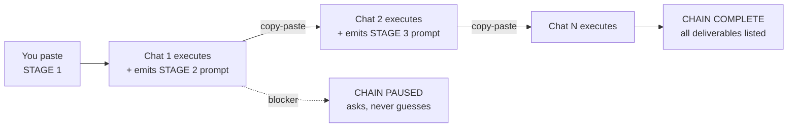

# prompt-chain

**English** · [Português](./skills/prompt-chain/SKILL.pt-BR.md)

**Break complex multi-step tasks into self-propagating prompts that survive context limits.**

The whole skill is one 307-line markdown file. No dependencies, no server, no external state store. Built for anyone running long multi-phase work in Claude — developers and non-developers alike.

[Install](#install) • [How it works](#how-it-works) • [When to use](#when-to-use) • [FAQ](#faq)

---

A Claude skill for chaining work across fresh chat sessions. Each prompt
generates the next, carrying full context forward. Cold-start safe.
Context-limit immune.

## How it works



| Without prompt-chain | With prompt-chain |
|----------------------|-------------------|
| One mega-prompt, context fills up, output degrades, you lose state when the chat dies. | A first prompt sets the chain. Each chat finishes its phase and outputs the next self-contained prompt. You paste it into a new chat. State carries. |

Same work. Half the friction. No mid-session collapse.

## Install

```bash
# Via skills CLI (recommended)
npx skills add 1marcelserrano/prompt-chain

# Or manually — back up first if the folder already exists:
# mv ~/.claude/skills/prompt-chain ~/.claude/skills/prompt-chain.backup
git clone https://github.com/1marcelserrano/prompt-chain.git
cp -r prompt-chain/skills/prompt-chain ~/.claude/skills/
```

**Verify:** open a new Claude session and run `/skills` (or ask "what skills do you have?"). `prompt-chain` should be listed. If it isn't, check that `~/.claude/skills/prompt-chain/SKILL.md` exists and restart the session.

**Update:** `git pull` in the cloned repo, then re-copy. New versions are logged in [CHANGELOG.md](./CHANGELOG.md).

## When to use

Trigger phrases (EN + PT-BR):

- "execute in stages across separate chats"
- "split this across sessions"
- "self-propagating prompt"
- "prompt that generates the next"
- "chain of prompts"
- "cold start between chats"
- "executar por etapas em chats separados"
- "cada etapa em um novo chat"
- "prompt autocontido autopropagante"

Natural language works too. Just describe the multi-phase task and ask
for it to be split.

## Why

- **Context limits stop being a wall.** Each phase runs in a fresh session with only what it needs.
- **Phases isolate failures.** A broken phase 3 doesn't poison phases 4-7.
- **Resumable.** Lost the chat? Open the last good prompt, continue.
- **Hand-offable.** Each prompt is self-contained — you or someone else can pick up any link.

## What it does / doesn't

| Does | Doesn't |
|------|---------|
| Break P0 → P1 → P2 → ... structure | Execute the phases for you |
| Pass context forward via prompt text | Use external state stores |
| Auto-detect chainable patterns | Force-chain trivial single-step tasks |
| Work in any chat-based Claude interface | Require a specific platform |

## vs. session-handoff tools

Tools like [handoff](https://github.com/thepushkarp/handoff) snapshot a session's state so you can resume it later. Useful, and a different job:

| Session-handoff tools | prompt-chain |
|---|---|
| React when a session fills up — save state, resume later. | Plan the whole crossing upfront — N stages, each with its own Definition of Done. |
| One link at a time. | The full chain is designed before stage 1 runs. |
| Usually tied to Claude Code (filesystem + hooks). | Any chat interface — state travels inside the prompt text itself. |

Use handoff when a session surprises you. Use prompt-chain when you can see the phases coming.

## FAQ

**Does it send my data anywhere?**
No. The skill is a markdown file Claude reads locally. Your prompts and context stay inside your normal Claude sessions — nothing extra is stored or transmitted.

**How do I uninstall?**
Delete the folder: `rm -rf ~/.claude/skills/prompt-chain`. Done.

**What does it work with?**
Any chat-based Claude interface: Claude Code (CLI/desktop), Claude.ai, Claude Cowork. macOS, Linux, Windows — it's just markdown.

**Will it be maintained?**
Yes. Versions follow [CHANGELOG.md](./CHANGELOG.md). Update with `git pull` or re-run `npx skills add`.

## About the author

Built by [Marcel Serrano](https://github.com/1marcelserrano), founder of [MSCREATIVE.SYSTEMS™](https://mscreative.systems) — Barcelona. This skill is the propagation backbone behind the MSCS editorial and skill ecosystem.

More on working with AI without losing your own voice: [Fronteirista](https://fronteirista.substack.com) — the free newsletter where these systems get built in public.

## Contributing

PRs welcome. See [CONTRIBUTING.md](./CONTRIBUTING.md).

## License

MIT — see [LICENSE](./LICENSE).

---

<sub>Forged at [MSCREATIVE.SYSTEMS™](https://mscreative.systems) — Barcelona</sub>
