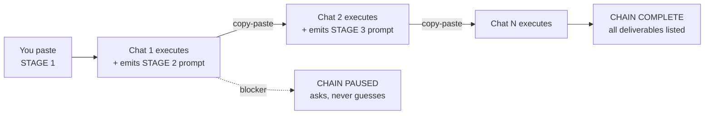
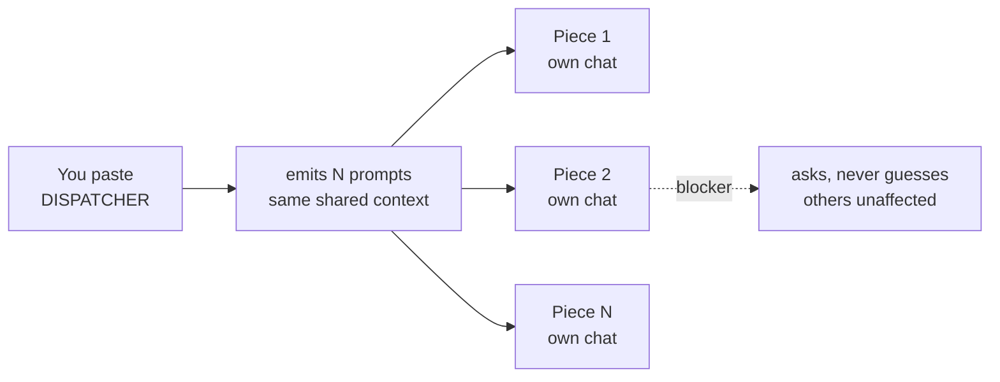

# prompt-chain

**English** · [Português](./skills/prompt-chain/SKILL.pt-BR.md)

**Break complex multi-step work into self-contained prompts that survive context limits — chained (sequential) or fanned out (independent).**

The whole skill is a single markdown file. No dependencies, no server, no external state store. Built for anyone running long multi-phase work in Claude — developers and non-developers alike.

[Install](#install) • [How it works](#how-it-works) • [When to use](#when-to-use) • [FAQ](#faq)

---

A Claude skill for distributing work across fresh chat sessions, in two modes: **CHAIN** (each prompt generates the next, carrying full context forward, until done) and **FAN-OUT** (one independent prompt per piece, no ordering, run in any order). Cold-start safe. Context-limit immune.

## How it works

Two modes, picked by one question — **do the pieces depend on each other's output or state?**

**CHAIN** (yes — order is load-bearing): each prompt runs one stage and emits the next.


```mermaid
flowchart LR
    A[You paste<br>STAGE 1] --> B[Chat 1 executes<br>+ emits STAGE 2 prompt]
    B -->|copy-paste| C[Chat 2 executes<br>+ emits STAGE 3 prompt]
    C -->|copy-paste| D[Chat N executes]
    D --> E[CHAIN COMPLETE<br>all deliverables listed]
    B -.blocker.-> P[CHAIN PAUSED<br>asks, never guesses]
```

**FAN-OUT** (no — pieces are independent): one dispatcher emits N self-contained prompts; each runs alone, in any order, sharing the same stable context.


```mermaid
flowchart LR
    A[You paste<br>DISPATCHER] --> B[emits N prompts<br>same shared context]
    B --> P1[Piece 1<br>own chat]
    B --> P2[Piece 2<br>own chat]
    B --> P3[Piece N<br>own chat]
    P2 -.blocker.-> Q[asks, never guesses<br>others unaffected]
```

| Without prompt-chain | With prompt-chain |
|----------------------|-------------------|
| One mega-prompt, context fills up, output degrades, you lose state when the chat dies. | A first prompt sets the work. Each chat finishes its piece self-contained — emitting the next (chain) or just reporting (fan-out). State carries; nothing collapses mid-session. |

Same work. Half the friction. No mid-session collapse.

## Install

```bash
# Via skills CLI (recommended)
npx skills add 1marcelserrano/prompt-chain

# Or manually — back up first if the folder already exists:
# mv ~/.claude/skills/prompt-chain ~/.claude/skills/prompt-chain.backup
git clone https://github.com/1marcelserrano/prompt-chain.git
cp -r prompt-chain/skills/prompt-chain ~/.claude/skills/
```

**Verify:** open a new Claude session and run `/skills` (or ask "what skills do you have?"). `prompt-chain` should be listed. If it isn't, check that `~/.claude/skills/prompt-chain/SKILL.md` exists and restart the session.

**Update:** `git pull` in the cloned repo, then re-copy. New versions are logged in [CHANGELOG.md](./CHANGELOG.md).

## When to use

Trigger phrases (EN + PT-BR):

- "execute in stages across separate chats"
- "split this across sessions"
- "self-propagating prompt"
- "prompt that generates the next"
- "chain of prompts"
- "cold start between chats"
- "one prompt per task" / "fan out into independent prompts"
- "executar por etapas em chats separados"
- "cada etapa em um novo chat"
- "prompt autocontido autopropagante"
- "um prompt por pendência" / "vários prompts independentes"

Natural language works too. Just describe the multi-phase task and ask
for it to be split — sequential pieces become a chain, independent ones a fan-out.

## Why

- **Context limits stop being a wall.** Each phase runs in a fresh session with only what it needs.
- **Phases isolate failures.** A broken phase 3 doesn't poison phases 4-7.
- **Resumable.** Lost the chat? Open the last good prompt, continue.
- **Hand-offable.** Each prompt is self-contained — you or someone else can pick up any link.

## What it does / doesn't

| Does | Doesn't |
|------|---------|
| Break work into a sequential chain (P0 → P1 → P2 …) or a fan-out of independent prompts | Execute the phases for you |
| Pass context forward via prompt text | Use external state stores |
| Route chain vs fan-out by whether pieces depend on each other | Force-chain trivial single-step tasks, or serialize independent work |
| Work in any chat-based Claude interface | Require a specific platform |

## How it compares

Two neighboring families solve related problems. Different jobs:

| | Session-handoff tools | Workflow engines | prompt-chain |
|---|---|---|---|
| **When it acts** | Reacts when a session fills up — save state, resume later | Runs a coded pipeline you build first | Plans the whole crossing upfront — N stages (chain) or N independent prompts (fan-out), each with its own Definition of Done |
| **Scope** | One link at a time | Full orchestration: retries, validation, branching | The full chain or fan-out is designed before the first prompt runs |
| **Where state lives** | Files, hooks, hidden dirs | Databases, APIs, app state | Inside the prompt text itself |
| **Requires** | Usually Claude Code (plugin + hooks) | Code, a runtime, often a server | A chat window |
| **Examples** | [handoff](https://github.com/thepushkarp/handoff), [claude-handoff](https://github.com/willseltzer/claude-handoff) | LangGraph, workflow engines | this repo |

Sourcegraph's [Amp Handoff](https://ampcode.com/news/handoff) also generates the next thread's prompt — reactive, one link at a time, inside Amp's paid stack. prompt-chain does the planned, multi-stage version of that idea in plain markdown.

Use handoff when a session surprises you. Use a workflow engine when the orchestration deserves code. Use prompt-chain when you can see the phases coming and want zero infrastructure.

Worked examples: [examples/](./examples/) — full chains (Stage 1, the emitted Stage 2, and `CHAIN COMPLETE`) plus a fan-out (dispatcher → N independent prompts).

Evidence: [benchmark/](./benchmark/) — the same dead task continued three ways (no carry · handoff snapshot · chain prompt), raw transcripts included.

Ready-to-fill seeds: [templates/](./templates/) — research, refactor, launch, audit, and content chains.

## FAQ

**Does it send my data anywhere?**
No. The skill is a markdown file Claude reads locally. Your prompts and context stay inside your normal Claude sessions — nothing extra is stored or transmitted.

**How do I uninstall?**
Delete the folder: `rm -rf ~/.claude/skills/prompt-chain`. Done.

**What does it work with?**
Any chat-based Claude interface: Claude Code (CLI/desktop), Claude.ai, Claude Cowork. macOS, Linux, Windows — it's just markdown.

**Will it be maintained?**
Yes. Versions follow [CHANGELOG.md](./CHANGELOG.md). Update with `git pull` or re-run `npx skills add`.

## About the author

Built by [Marcel Serrano](https://github.com/1marcelserrano), founder of [MSCREATIVE.SYSTEMS™](https://mscreative.systems) — Barcelona. This skill is the propagation backbone behind the MSCS editorial and skill ecosystem.

More on working with AI without losing your own voice: [Fronteirista](https://fronteirista.substack.com) — the free newsletter where these systems get built in public.

## Contributing

PRs welcome. See [CONTRIBUTING.md](./CONTRIBUTING.md).

## License

MIT — see [LICENSE](./LICENSE).

---

<sub>Forged at [MSCREATIVE.SYSTEMS™](https://mscreative.systems) — Barcelona</sub>
